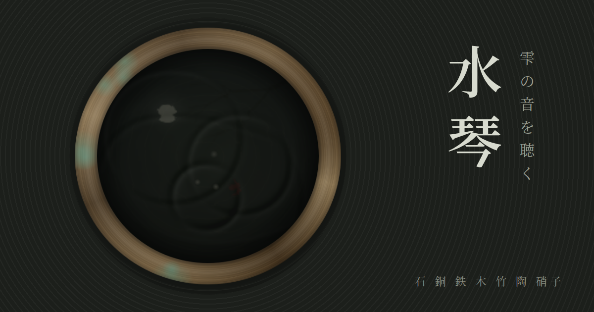

# 水琴 — 雫の音を聴く



水盆に雫を落とすと、水面に波紋が広がり、音が鳴ります。
日本庭園の水琴窟（すいきんくつ）をモチーフにした、ブラウザで動くWebアプリです。

**▶ 遊ぶ：** https://kanameshiga-dev.github.io/suikin/

## 遊び方

- **水面をタップ**すると雫が落ちます。中心ほど低く、縁へゆくほど高い音。
- **指でなぞる**と、連なって鳴ります。
- **響き**：波紋同士が出会った瞬間、その場所が灯り、二つの音の倍音が重なって響きます。
- **雨**：盆のあちこちに雫が降り続けます。

### 素材

| 素材 | 音の性格 |
|---|---|
| 石 | 澄んだ鈴のような余韻（標準） |
| 銅 | 低く、おりんのようにうなりながら長く響く |
| 鉄 | さらに低く、濁りを含んで沈む |
| 木 | こもった柔らかい「ぽこん」 |
| 竹 | 乾いた筒の共鳴 |
| 陶 | やや高く、硬く短い |
| 硝子 | 最も高く澄み、残響が深い |

### 音階

- **都節**：侘びた陰の響き
- **律**：明るく雅な響き
- **琉球**：南の開けた響き

### 奏でる

曲の一音一音が雫となって、盆の上に散りながら落ちていきます。

- さくら（日本古謡）
- 蛍の光（スコットランド民謡）
- 歓喜の歌（ベートーヴェン 交響曲第9番より）
- 即興（選んでいる音階で旋律を紡ぎ続けます）

収録曲はいずれも著作権保護期間が満了した楽曲です。

## 動作環境

- iPhone / Android / PC の最新ブラウザ（Safari・Chrome・Edge・Firefox）
- 音はすべて Web Audio API でその場で合成しています（音声ファイルなし）
- **iPhone でマナーモード（消音スイッチ）がオンだと音が出ない**ことがあります
- スマートフォンで「ホーム画面に追加」すると、アプリのように全画面で起動できます

## GitHub Pages で公開する手順

### ブラウザだけで行う場合

1. GitHub で新しいリポジトリ `suikin` を作成（Public）
2. 「Add file」→「Upload files」で、このフォルダの中身をすべてドラッグ＆ドロップしてコミット
   （`index.html` がリポジトリの直下に来るようにします）
3. リポジトリの **Settings → Pages** を開く
4. **Source** を「Deploy from a branch」、**Branch** を `main` / `/ (root)` にして Save
5. 1〜2分後、`https://<ユーザー名>.github.io/suikin/` で公開されます

### git コマンドで行う場合

```bash
cd suikin
git init
git add .
git commit -m "水琴 初回公開"
git branch -M main
git remote add origin https://github.com/<ユーザー名>/suikin.git
git push -u origin main
```

その後、上の手順 3〜4 で Pages を有効にします。

### ユーザー名やリポジトリ名が違う場合

`index.html` の `og:url` と `og:image`、この README の URL を、実際の公開 URL に書き換えてください。
（SNS でリンクを共有したときのプレビュー画像に使われます）

## ファイル構成

```
index.html              アプリ本体（HTML / CSS / JavaScript を1ファイルに収録）
manifest.webmanifest    ホーム画面に追加したときの設定
icons/                  ファビコン・アプリアイコン
ogp.png                 SNS共有時のプレビュー画像（1200×630）
.nojekyll               GitHub Pages の Jekyll 処理を無効化
LICENSE                 MIT ライセンス
```

外部依存は Google Fonts（しっぽり明朝）のみです。読み込めない環境では端末の明朝体で表示されます。

## ライセンス

[MIT License](LICENSE)
